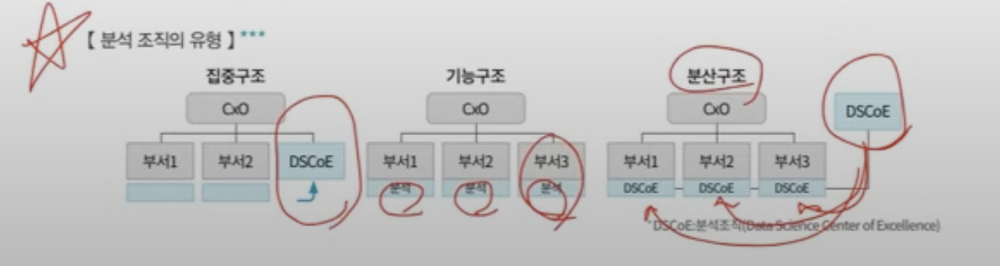

데이터베이스의 정보 관리 측면에 대한 설명?
- **정보관리 측면**
	- 정보를 일정한 질서와 구조에 따라 정리&저장하고 검색&관리할 수 있게 하여 방대한 양의 정보를 체계적으로 축적하고, 새로운 내용 추가나 갱신이 용이함
- **정보의 축적 및 전달 측면**
	- **기계 가독성**
	- **검색 가능성**
	- **원격 조작성**

초기 빅데이터의 3V 요소
- 크기(Volume)
- 속도(Velocity)
- 다양성(Variety)

> **Veracity**는 **정확성**을 의미함

**데이터웨어하우스 (DataWarehouse)**
> 일반적으로 기업이 보유한 원천 데이터들은 클라우드, 서버, 로컬 등 다양한 환경에 분산되어 저장됨. <mark>이러한 데이터를 한곳으로 모아 통합 관리하는 데이터베이스</mark>

**데이터 마트**
> 주간 업무보고, 월간 업무보고... 보고서들이 데이터 마트이다. 이미 DW에 모아둔 정보들을 가지고 DM를 만들고, 이를 바탕으로 보고서를 만든다 

**데이터 레이크**
> 비정형데이터와 반정형데이터를 데이터 레이크에 모아서, 데이터 마트를 만들기도 한다

- 새로 발견된 생물에 대한 종의 분류에는 **유형분석**을 활용한다.
- 최적의 택배 차량 배차에는 **유전 알고리즘**을 활용한다.
- 아이템에 대한 대중적인 평가를 위해 리뷰 데이터를 활용하여 **감정분석**을 수행한다.
- 인구 유동량, 부동산 가격 등을 활용해 특정 가맹점의 예상 매출액을 산출하기 위해 **회귀 분석**을 활용한다.

**연관 규칙 학습**
> 어떤 변인 간에 주목할 만한 상관 관계가 있는지를 찾아내는 방법

**유형분석**
> 새로운 사건이 속할 범주를 찾아내는 방법

`이 사용자가 어떤 특성을 가진 집단에 속하는가?`와 같은 문제를 해결하는 방법

- 분류 Classification - 지도학습
- 군집 Clustering - 비지도학습

**유전 알고리즘**
> 최적화가 필요한 문제의 해결책을 <u>자연선택, 돌연변이 등과 같은 메커니즘</u>을 통해 점진적으로 진화시켜 나가는 방법

어떻게 배치하는가?

**기계학습 = 머신러닝** (Machine Learning)
> 컴퓨터가 <u>데이터로부터 규칙을 찾고, 이러한 규칙을 활용해 예측하는 데 초점을 둔 방법</u>

- 유튜브 및 넷플릭스의 미디어 추천 시스템
- 스팸메일 필터링
- 질병 진단 예측

**회귀분석(Regression Analysis)**
> 독립변수를 조작하면서 종속변수가 어떻게 변하는지를 보며 수치형으로 이루어진 두 변인의 관계를 파악하는 방법

- 사용자의 만족도가 충성도에 **어떤 영향**을 미치는가?
- 이웃들과 그 규모가 집값에 **어떤 영향**을 미치는가?
- 상품가격은 매출에 **어떤 영향**을 미치는가?

**빅데이터의 등장으로 발생한 변화는?**
- 후 (사후처리가 중시): 사전처리 < 사후처리
- 전 (전수조사가 우선시): 표본조사 < 전수조사
- 양 (질보다 양): 질 < 양
- 상 (상관관계): 인과관계 < 상관관계

**비정형 데이터**
- 사진, 영상, 댓글

**빅데이터의 가치 패러다임 변화 과정**
`Digital` ➡️ `Connection` ➡️ `Agency`
디지털화, 연결, 에이전시
> Agency는 쉽게, management라고 생각하면 된다

**빅데이터가 등장할 수 있는 배경**
- 대량의 데이터 축적
- 인터넷 및 클라우드의 발전
- 분석 처리 기술의 발전

**분석 기획 시 고려사항**
- 사용 가능한 데이터 고려
- 유사 시나리오 탐색
- 장애 요소에 대한 사전 계획 수립 (비용을 생각하는 것이 아니라...)

**데이터 준비 단계에서 고려해야 할 사항**
- 정형, 비정형, 반정형 데이터 모두 수용할 수 있어야 함
- 기업 뎅터 사용 시 전사적으로 모든 데이터를 사용해야 함
- 회사 내부 정보 활용 시 기업은 정보 주체에 대한 동의와 함께 활용 가능함
- 수집된 데이터에 대해 정당성 검증을 수행해야 함

**분석 프로젝트 관리 방안**

**조달** : 프로젝트 목적에 부합하는 <u>아웃소싱 관리, 인프라 구매, 클라우드 활용 방안 등을 검토하는 방법</u>

**빅데이터 분석 방법론**
`단계`➡️ `태스크` ➡️ `스텝`

<mark>스텝은 입력과 출력으로 구성된다</mark>

**정확도 vs 정밀도**
- **정확도**: 모델의 활용성 측면, 예측값이 실제값과 얼마나 가까운지?
- **정밀도**: 모델의 안정성 측면, 반복적으로 수행했을 때 실제 값과의 편차 수준

**분석 과제의 우선순위**
> 시급성이 높고 난이도가 낮은 문제

**확산형**
> 높은 준비도, 높은 성숙도

**데이터 표준화 단계**에서 수행해야 할 과제
1) 표준 용어 설정
2) 명명 규칙 수립
3) 데이터 사전 구축 

**앙상블 기법**
> 분류 분석의 정확도를 향상시키기 위한 기법

**나이브 베이즈 이론** 
- <mark>귀납적 추론 방법</mark>
- 과거 경험과 현재 증거를 기반으로 미래를 추정함
- 각 특성이 서로 독립이라는 가정하에 수행됨 
- 계산이 간단하고 빠르다는 장점이 있음
- 예시) 스팸 메일 필터링, 텍스트 분류 등

**베이즈 이론**
> 데이터를 통해 확률을 추정할 때, <u>현재 관측된 데이터의 빈도만으로 분석하는 것이 아니라, 분석자의 사전지식(이미 알려진 사실 혹은 분석자의 주관)까지 포함해 분석하는 방법</u>

**다중 회귀**
> <mark>하나의 종속 변수가 여러 개의 설명 변수의 일차원적 선형 관계로 표현되는 회귀식</mark>

일차원적 선형 관계라고 했기 때문에, 다항 회귀가 아니라 **다중 회귀**가 답이 된다!

**집락 추출법**
> <u>모집단 간 동질, 모집단 내 원소 간 이질적인 성격</u>을 갖도록 표본을 추출하는 방법

**층화 추출법** 
> <u>모집단 간 이질, 모집단 내 원소 간 동질적인 성격</u>을 갖도록 표본을 추출하는 방법

**상관 관계**
-1 < 상관 계수 < 1
> 상관 관계가 강하다는 것은 +0.5 정도 -0.5 정도

**인공 신경망**에서 **가중치**를 부여하는 목적?
> 입력 신호의 강도 조절

**확률 특성**
- 확률값은 0과 1사이의 값을 갖는다
- 연속 확률 분포에서 특정 값을 가질 확률은 0이다
- <u>두 사건 A, B에 대해서 A, B가 독립 사건이면</u> P(A 교집합 B) = P(A) X P(B)가 성립한다

**K 평균 군집 분석**
- 군집화가 수행되는 과정 중에 <mark>하나의 데이터는 여러 개의 군집에 배정될 수 없음</mark>
- 이상값에 민감하다는 단점이 있음
- 초기에 군집의 중심을 임의로 설정할 수 있음
- 군집의 개수를 사전에 정의해야 함 

**1종 오류**
> 귀무가설이 **사실**일 때, 귀무가설을 **거짓**이라고 판정한다

**2종 오류**
> 귀무가설이 **거짓**일 때, 귀무가설을 **사실**이라고 판정한다

**배깅**
> 원 데이터 집합으로부터 크기가 같은 여러 개의 붓스트랩을 생성하고, 각 붓스트랩으로부터 분류기를 생성하여 보팅에 의해 최종 결과를 도출하는 방법

**부스팅**
> 이전 모델 결과에 대해 <mark>잘못 분류된 데이터에 더 큰 가중치를 두어 새로 붓스트랩을 구성</mark>하여 다음 분류기를 생성하는 방법

**분석 목적 및 기법**
- 분류 분석 & 로지스틱 회귀 분석
- 분류 & 의사결정나무
- 연관분석 & 장바구니분석

**데이터의 정규성**을 검증하기 위한 방법
- 히스토그램
- QQ plot
- Shapiro Wilk Test

**의사결정나무**에서 **가지치기**를 하는 이유?
-> 과적합 방지 

의사결정나무도 데이터 마이닝 기법 중 하나로 모형이 복잡한 경우 과적합이 너무 단순한 경우 과소적합이 발생한다. 의사결정나무의 성장이 끝났지만 모형이 너무 복잡한 경우, 과적합이 발생할 수 있어 일부 가지를 적당히 제거하여 적당한 크기의 완성된 의사결정나무 모형으로 만들어준다.

**최장 연결법**
> 군집에서 가장 먼 데이터를 기준으로 거리를 측정하는 방법

**코사인 유사도**
> 두 벡터 간의 유사도를 측정하기 위해 벡터 간 이루는 각도를 활용하는 것

-> 범주형 변수일 때 거리 측정을 위한 것임

**척도**
- 명목척도: 범주형 자료를 의미함
- 서열척도: 범주형 자료들이 순서를 가진 자료를 의미함
- 등간척도: 양적 척도 자료가 상대적 크기를 갖는 자료를 의미함
- 비율척도: 양적 척도가 절대적 크기를 가진 자료를 의미함 

**연관 분석**
거래량이 적은 품목에 대해서는 규칙을 쉽게 발견할 수 없고, 거래량이 많은 품목에서 규칙을 쉽게 발견할 수 있다

**파생 변수**
- 파생변수는 주관적인 변수로써 논리적 타당성을 확보해야 함
- 생성된 파생변수를 반드시 알고리즘에 활용할 필요는 없음
- 여러 변수 간에 다중공선성이 존재한다면, 파생변수를 활용해 다중공선성을 제거할 수 있음
- 파생변수는 범주형 변수일 수도 있음

**결측값 대치**
완전 대치법은 높은 정보 손실율을 보인다

**다차원 척도법**
변수 간의 거리를 측정하고 객체 간 거리를 실수 범위 내에서 유지하면서, <u>차원을 축소하여 저차원 공간에 점으로 표현하는 기법</u>

상관 관계가 약하다는 것은.. 0이 제일 약한 것임!

